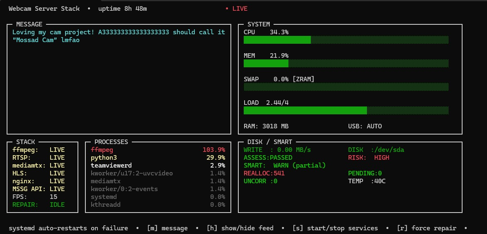
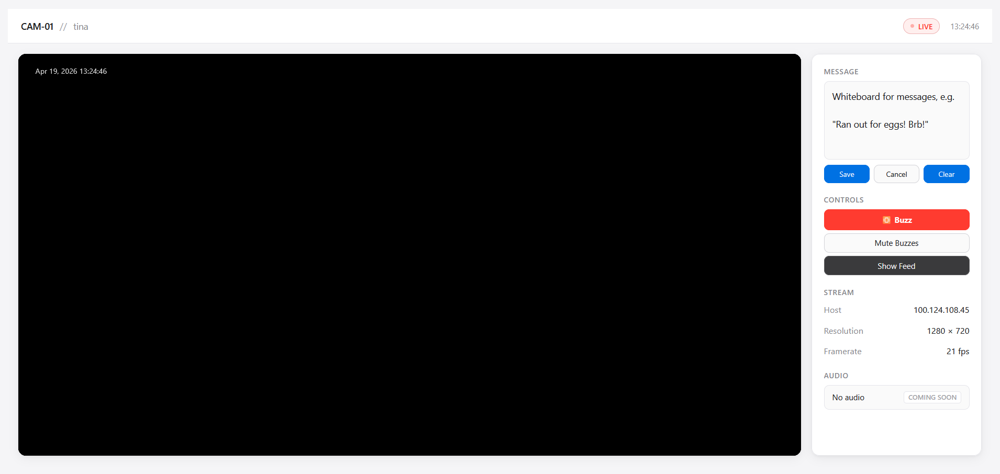

# hls-livecam-server

A Debian package that turns a USB webcam into a live HLS stream with a browser-based family presence system — message board, dark mode cloak, buzz notifications, and a terminal monitor.



---

## What it does

- **Streams** a USB webcam via HLS (H.264, MediaMTX + ffmpeg) to any browser — Chrome, Firefox, Safari, mobile
- **Web viewer** with live status indicator, uptime counter, freeze-frame on signal loss, and fullscreen
- **Message board** — type a message from `camstack` or the sidebar; it persists until cleared
- **Dark mode** — cloaks the feed with a black overlay; the stream keeps running underneath
- **Buzz** — MSN-style screen shake + sawtooth tone, triggered from the viewer sidebar or API
- **`camstack`** — curses TUI showing full pipeline health (ffmpeg → RTSP → mediamtx → HLS → nginx → API), system resources, SMART disk status, and service controls
- **Auto-repair** — detects stream down for 8s and triggers repair automatically



---

## Architecture

```
v4l2 device → ffmpeg → RTSP (:8554) → mediamtx → HLS (:8888) → nginx (:80) → browser
                                                                      ↑
                                                              broadcast-api (:5000)
```

- **ffmpeg-cam.service** captures from the stable `/dev/v4l/by-id/...` path, pushes RTSP to MediaMTX
- **mediamtx** serves HLS on `:8888`
- **nginx** proxies on `:80`, serves the web viewer, and routes `/api/broadcast`, `/api/dark`, and `/api/buzz` to the Flask broadcast API
- **broadcast-api** Flask service runs as `www-data` on `127.0.0.1:5000`
- **Dark mode** flag lives at `/var/lib/hls-livecam/dark`; cloak image at `/var/www/hls-livecam/dark.png`
- Device config persisted in `/etc/hls-livecam/device.env`

---

## Requirements

- Ubuntu 20.04+ / Linux Mint 20+ / Debian 11+ (amd64)
- USB webcam with MJPEG support
- Internet access during setup (downloads MediaMTX binary)

---

## Installation

```bash
# Install dependencies
sudo apt update
sudo apt install ffmpeg nginx v4l-utils python3 python3-psutil wget ca-certificates

# Install the package
sudo dpkg -i hls-livecam-server_2.2.0_amd64.deb

# Run the setup wizard
sudo hls-livecam-setup
```

The setup wizard auto-detects your webcam, downloads MediaMTX, writes all config, and starts all services.

---

## After setup

| What | Where |
|------|-------|
| Web viewer | `http://<your-ip>` |
| HLS stream | `http://<your-ip>:8888/cam/index.m3u8` |
| RTSP (VLC) | `rtsp://<your-ip>:8554/cam` |
| Terminal monitor | `camstack` |

---

## Commands

| Command | What it does |
|---------|-------------|
| `camstack` | Launch the TUI monitor |
| `sudo hls-livecam-setup` | Reconfigure / change webcam or framerate |
| `sudo hls-livecam-repair` | Fix a broken stream |
| `sudo hls-livecam-dark` | Toggle dark mode cloak |

### camstack keys

| Key | Action |
|-----|--------|
| `m` | Send broadcast message |
| `h` | Show / hide feed (dark mode) |
| `s` | Start / stop services |
| `r` | Force repair |
| `q` | Quit |

---

## Broadcast API

The Flask API runs locally and is proxied by nginx:

```bash
# Send a message (appears in the viewer sidebar and as a pill overlay)
curl -X POST http://localhost/api/broadcast \
  -d '{"message":"Ran out of eggs! Brb!"}' \
  -H 'Content-Type: application/json'

# Toggle dark mode
curl -X POST http://localhost/api/dark

# Trigger buzz (screen shake + sawtooth tone on all viewers)
curl -X POST http://localhost/api/buzz
```

---

## Troubleshooting

| Problem | Fix |
|---------|-----|
| Stream broken | `sudo hls-livecam-repair` |
| Service status | `sudo systemctl status mediamtx ffmpeg-cam` |
| Full logs | `sudo journalctl -u ffmpeg-cam -n 40 --no-pager` |
| Webcam busy | `sudo fuser -k /dev/video0` |
| List webcams | `v4l2-ctl --list-devices` |

---

## SMART note

If `camstack` reports `REALLOC > 500` in the DISK/SMART panel, your drive has significant sector reallocation. Back up your data. The stream will continue running but the drive should be replaced soon.

---

## License

GPL-3.0 — see [LICENSE](LICENSE)
