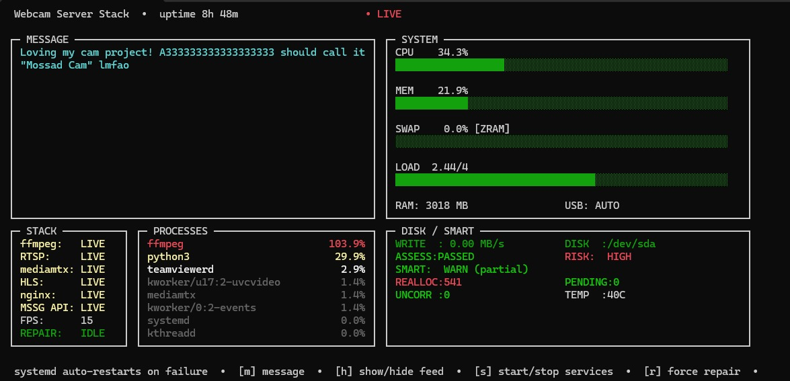
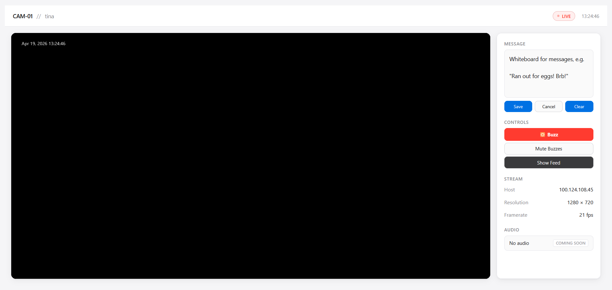

# hls-livecam-server

Turns an old laptop or a USB webcam into a live HLS stream with a browser-based family presence system — message board, dark mode cloak, buzz notifications, and a terminal monitor.



---

## What it does

- **Streams** a USB webcam via HLS (H.264, MediaMTX + ffmpeg) to any browser — Chrome, Firefox, Safari, mobile
- **Web viewer** with live status indicator, uptime counter, freeze-frame on signal loss, and fullscreen
- **Message board** — type a message from `camstack` or the sidebar; it persists until cleared
- **Dark mode** — cloaks the feed with a black overlay; the stream keeps running underneath
- **Buzz** — MSN-style screen shake + sawtooth tone, triggered from the viewer sidebar or API
- **`camstack`** — curses TUI showing full pipeline health (ffmpeg → RTSP → mediamtx → HLS → nginx → API), system resources, SMART disk status, and service controls
- **Auto-repair** — detects stream down for 8s and triggers repair automatically



---

## Architecture

```
v4l2 device → ffmpeg → RTSP (:8554) → mediamtx → HLS (:8888) → nginx (:80) → browser
                                                                      ↑
                                                              broadcast-api (:5000)
```

- **ffmpeg-cam.service** captures from the stable `/dev/v4l/by-id/...` path, pushes RTSP to MediaMTX
- **mediamtx** serves HLS on `:8888`
- **nginx** proxies on `:80`, serves the web viewer, and routes `/api/broadcast`, `/api/dark`, and `/api/buzz` to the Flask broadcast API
- **broadcast-api** Flask service runs as `www-data` on `127.0.0.1:5000`
- **Dark mode** flag lives at `/var/lib/hls-livecam/dark`; cloak image at `/var/www/hls-livecam/dark.png`
- Device config persisted in `/etc/hls-livecam/device.env`

---

## Requirements

- Ubuntu 20.04+ / Linux Mint 20+ / Debian 11+ (amd64)
- USB webcam with MJPEG support
- Internet access during setup (downloads MediaMTX binary)

---

## Installation

```bash
# Install dependencies
sudo apt update
sudo apt install ffmpeg nginx v4l-utils python3 python3-psutil wget ca-certificates

# Install the package
sudo dpkg -i hls-livecam-server_2.7.3_amd64.deb

# Run the setup wizard
sudo hls-livecam-setup
```

The setup wizard auto-detects your webcam, downloads MediaMTX, writes all config, and starts all services.

---

## After setup

| What | Where |
|------|-------|
| Web viewer | `http://<your-ip>` |
| HLS stream | `http://<your-ip>:8888/cam/index.m3u8` |
| RTSP (VLC) | `rtsp://<your-ip>:8554/cam` |
| Terminal monitor | `camstack` |

---

## Commands

| Command | What it does |
|---------|-------------|
| `camstack` | Launch the TUI monitor |
| `sudo hls-livecam-setup` | Reconfigure / change webcam or framerate |
| `sudo hls-livecam-repair` | Fix a broken stream |
| `sudo hls-livecam-dark` | Toggle dark mode cloak |

### camstack keys

| Key | Action |
|-----|--------|
| `m` | Send broadcast message |
| `h` | Show / hide feed (dark mode) |
| `s` | Start / stop services |
| `r` | Force repair |
| `q` | Quit |

---

## Broadcast API

The Flask API runs locally and is proxied by nginx:

```bash
# Send a message (appears in the viewer sidebar and as a pill overlay)
curl -X POST http://localhost/api/broadcast \
  -d '{"message":"Ran out of eggs! Brb!"}' \
  -H 'Content-Type: application/json'

# Toggle dark mode
curl -X POST http://localhost/api/dark

# Trigger buzz (screen shake + sawtooth tone on all viewers)
curl -X POST http://localhost/api/buzz
```

---

## Feed modes

Three modes, set from the viewer, the Qt dashboard or camdash, and persisted
across restarts in `/var/lib/hls-livecam/feed_mode`. When that file is missing
or unreadable the node falls back to **`cv`** — never to `show`. A privacy
control on a camera pointed at a family's living space does not get to fail
open.

| mode | what is published |
|---|---|
| `show` | the camera |
| `cv` | the camera, processed (see CV Mode) |
| `hide` | **VHS static**, plus silence |

`cloak` is accepted as a permanent alias for `cv` on `/api/feed-mode`. Not a
transition window — every node in the fleet talks to every other node's
endpoints and no two ship on the same day.

### Hide publishes static, not black

Rendered server-side, so the web viewer, the Qt dashboard, camdash and anyone
opening the HLS URL directly all get it — no per-surface wiring, and no
surface can miss the memo and show something else. It is derived from nothing:
no camera frame touches that path.

**Static is not expensive, and the widely-repeated claim that it is comes from
an unconstrained encoder.** Measured on tanzania, at the publisher's real
settings:

| | render | published |
|---|---|---|
| black | ~0 ms (cached array) | 40 kb/s |
| static | +3.6 ms/frame | **1560 kb/s** |
| the live feed, for scale | — | ~1500 kb/s (`-b:v 1500k`) |

So static costs **the same as the live feed**, not more, because `-b:v` is
doing rate control. Encode a noise clip with no bitrate cap and you will
measure 1.6–1.8 Mb/s and conclude static is costly; put the cap back and the
difference disappears. Two things make it cheap: the `-b:v` ceiling, and
generating the noise small (224×126) and scaling up **nearest-neighbour**, so
the encoder sees large flat blocks rather than per-pixel noise.

The viewer keeps a "camera is switched off" notice on top of the snow. Static
on its own is exactly what a dead feed looks like — that notice is the only
thing separating deliberate from broken.

### Room audio

Off by default. Set `AUDIO_ENABLED=1` in `/etc/hls-livecam/device.env` along
with `AUDIO_DEVICE` (default `hw:0,0`), and the publisher gains a second input
and publishes AAC alongside the video as an `EXT-X-MEDIA` rendition.

The service user must be in the `audio` group — `/dev/snd/*` is `root:audio`,
and the setup wizard adds it. Without it ffmpeg fails with `Cannot get card
index` and only the log says why.

**Hide closes the microphone.** Hidden swaps the ALSA input for `anullsrc`, so
the device is never opened — not muted, closed. `GET /api/audio` reports
`disabled` (no mic configured), `off` (configured but closed because hidden)
or `ok`, and reports the rate and bitrate this node actually gave ffmpeg,
never the manifest's `BANDWIDTH` (which is video+audio combined and overstates
audio badly).

**Stage the input before trusting it.** Both fleet nodes shipped with mics
that looked broken and were not — one with +60 dB of stacked gain railing the
input, one muted at 0. `mean_volume` alone will not tell you which you have;
**flat factor and DC offset** will. A railed input reads flat factor ~88 and
DC ~0.34, real audio reads flat factor 0.000 and DC ~0. Persist with
`alsactl store` once it is right.

---

## Troubleshooting

| Problem | Fix |
|---------|-----|
| Stream broken | `sudo hls-livecam-repair` |
| Service status | `sudo systemctl status mediamtx ffmpeg-cam` |
| Full logs | `sudo journalctl -u ffmpeg-cam -n 40 --no-pager` |
| Webcam busy | `sudo fuser -k /dev/video0` |
| List webcams | `v4l2-ctl --list-devices` |

---

## SMART note

If `camstack` reports `REALLOC > 500` in the DISK/SMART panel, your drive has significant sector reallocation. Back up your data. The stream will continue running but the drive should be replaced soon.

---

## License

GPL-3.0 — see [LICENSE](LICENSE)
